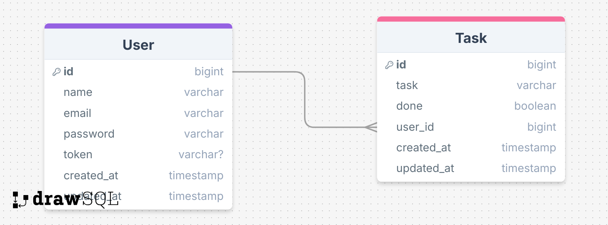

# 📝 Projeto Todo-list


 &nbsp;
 &nbsp;
&nbsp;
[](https://nodejs.org)

## 🔍 Sobre o Projeto

Este projeto é uma aplicação construída com **AdonisJS**, um dos frameworks mais robustos para **Node.js**. Através deste framework MVC, simplificamos a criação de APIs e aplicativos web. Neste projeto, abordaremos desde a instalação do AdonisJS até a criação de rotas, controllers e muito mais, oferecendo uma base sólida para acelerar o desenvolvimento com Node.js. A seguir, estão os passos para configurar o ambiente de desenvolvimento.

## 🛠️ Tecnologias e Ferramentas Utilizadas


<p align="center">
 <a href="https://skillicons.dev">
    
    <a href="https://skillicons.dev/icons?i=nodejs"></a>
    
    <a href="https://skillicons.dev/icons?i=npm"></a>
    <a href="https://skillicons.dev/icons?i=yarn"></a>
     
    
    <a href="https://skillicons.dev/icons?i=docker"></a>
    
    
    
</a>


</p>


# 📦 Configuração do Ambiente de Desenvolvimento
Primeiro, confira se o `node` está acima da versão 14:

```bash
node -v
```

Para criar o projeto, use:

```bash
npm init adonis-ts-app@latest api
```

Caso não dê certo com `npm`, utilize o `yarn`. Primeiro, instale o `yarn` utilizando o comando:

```bash
npm install -g yarn
```

Depois, execute o comando para criar o projeto:

```bash
yarn create adonis-ts-app api
```

Selecione a estrutura de projeto “api”, coloque o nome de “api”, coloque `true` para o uso de eslint e `true` para o uso de prettier.

## 🗄️ Parte de Database

Instalação do Lucid, que é o ORM que o Adonis trabalha:

```bash
yarn add @adonisjs/lucid@18.4.0
```

Depois de instalar a biblioteca, é necessário configurá-la:

```bash
node ace configure @adonisjs/lucid
```

Selecione o `PostgreSQL` utilizando a barra de espaço. Depois, escolha onde quer que sejam exibidas as informações de variáveis de ambiente, no `terminal` ou no `browser`.

Como vou utilizar PostgreSQL, é necessário incluir as variáveis no arquivo `env.ts`:

```typescript
PG_HOST: Env.schema.string({ format: 'host' }),
PG_PORT: Env.schema.number(),
PG_USER: Env.schema.string(),
PG_PASSWORD: Env.schema.string.optional(),
PG_DB_NAME: Env.schema.string(),
```

### 🐳 Criar um Banco de Dados no Docker

Inicialize o Docker e inicie o container:

```bash
docker start [CONTAINER_NAME] ou [CONTAINER_ID]
```

Depois, use `docker exec` para rodar o SQL no PostgreSQL:

```bash
docker exec -it postgres sql -U postgres
```

Então, crie uma database:

```sql
create database todo;
```

Para sair, use:

```sql
/q
```

Depois, coloque as informações no arquivo `.env`.

## 🔐 Autenticação

Instale a autenticação:

```bash
yarn add @adonisjs/auth@8.2.3
```

E também deve ser feita a configuração:

```bash
node ace configure @adonisjs/auth
```

Ele pergunta qual será o provedor: `Lucid` (ORM padrão do AdonisJS) ou `QueryBuilder`. No caso, utilize o `Lucid`.

Ele pergunta qual o tipo de tokens (Web, API tokens ou Basic Auth). Será utilizado o API tokens, que é uma melhoria do JWT.

Pergunta qual o nome do model que será utilizado para autenticação. O nome será `User`.

Pergunta se quer criar a migration de User.

Pergunta onde gravar os tokens: no `Redis` (banco de dados de alto desempenho baseado em chave-valor) ou utilizar uma própria database. Como será utilizada uma database própria, criamos uma migration `api_tokens`.

Agora, replicar o modelo do banco de dados para a migration:



Agora, é necessário criar uma migration para tasks, usando o comando:

```bash
node ace make:model Task -c -m
```

Poderia ter sido criado o model, o controller e a migration separadamente, mas com esse comando é criado tudo de uma vez só.

Depois, faça as alterações nos models `User.ts` e `Task.ts`, e faça o relacionamento entre as tabelas:

```typescript
@hasMany(() => Task)
public tasks: HasMany<typeof Task>
```

Depois, podemos rodar as migrations usando o código:

```bash
node ace migration:run
```


## 🔍 Acessando o PostgreSQL

Execute novamente o comando para entrar no PostgreSQL:

```bash
docker exec -it postgres sql -U postgres
```

Use o comando para abrir a database:

```sql
\c [NOME_DO_BANCO]
```

Após entrar no banco, execute:

```sql
\dt
```

Para mostrar quais tabelas estão no database.

Caso queira ver somente uma tabela, execute o comando:

```sql
\d [NOME_DA_TABELA]
```

## 🛠️ Criando Controller de User

```bash
node ace make:controller User -r
```

Importação do User para o controller:

```typescript
import User from 'App/Models/User'
```

Depois, faça as construções dos métodos.

O usuário precisa ser autenticado para ter suas tasks. Para isso, vamos criar um controller para autenticação:

```bash
node ace make:controller Session -r
```

## 🚀 Criação das Rotas

### Criação das Rotas de Usuário e Autenticação

Utilizando o comando:

```bash
Route.resource('/user', 'UsersController').apiOnly()
```

Conseguimos criar as 5 rotas de uma vez só. Para visualizar as rotas, use o código abaixo:

```bash
node ace list:routes
```


## 🏃 Executando o Projeto

Para rodar o projeto, utilize o comando:

```bash
yarn dev
```


## 🔒 Criando Middleware de Autenticação

Ao criar os métodos do `/task`, vamos criar um `middleware` de autenticação. Vamos entrar no arquivo `start/kernel` e registrar o middleware no final:

```typescript
Server.middleware.registerNamed({
	auth: () => import('App/Middleware/Auth')
})
```

Como é um resource, ele não consegue passar o ‘auth’ diretamente:

```typescript
Route.resource('/task', 'TasksController').apiOnly().middleware('auth') // não dá certo assim
```

Precisamos criar um grupo por fora:

```typescript
Route.group(() => {
  Route.resource('/task', 'TasksController').apiOnly()
}).middleware('auth')
```


## 🗝️ Criando Rotas de Autenticação

```typescript
Route.post('/session', 'SessionsController.store')
Route.delete('/session', 'SessionsController.destroy').middleware('auth')
```

## 📚 Referência

Para mais detalhes e guias sobre o AdonisJS, consulte a documentação oficial: [AdonisJS Documentation](https://v5-docs.adonisjs.com/guides/introduction).
